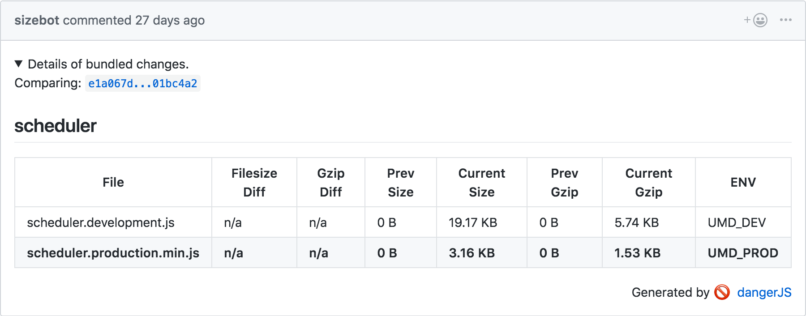
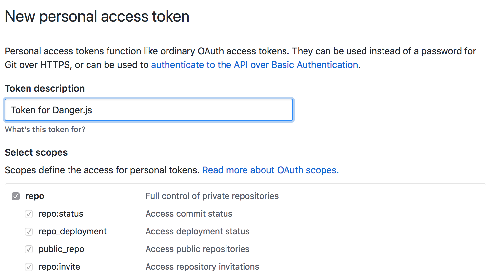
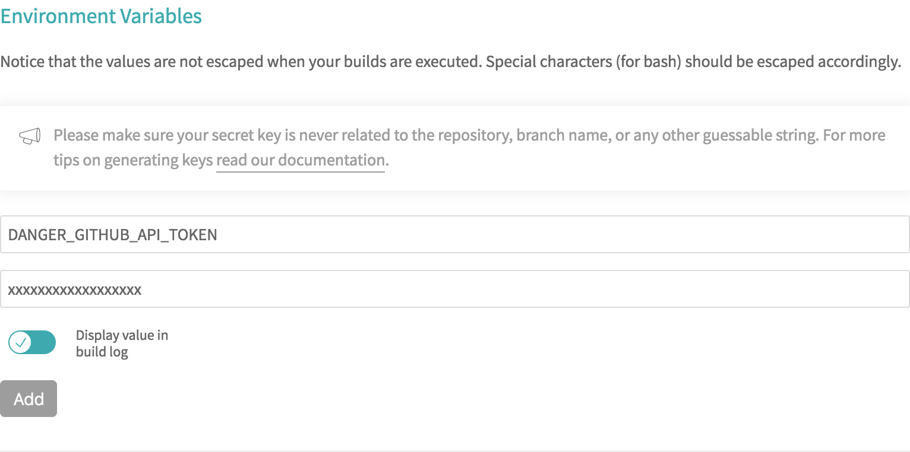
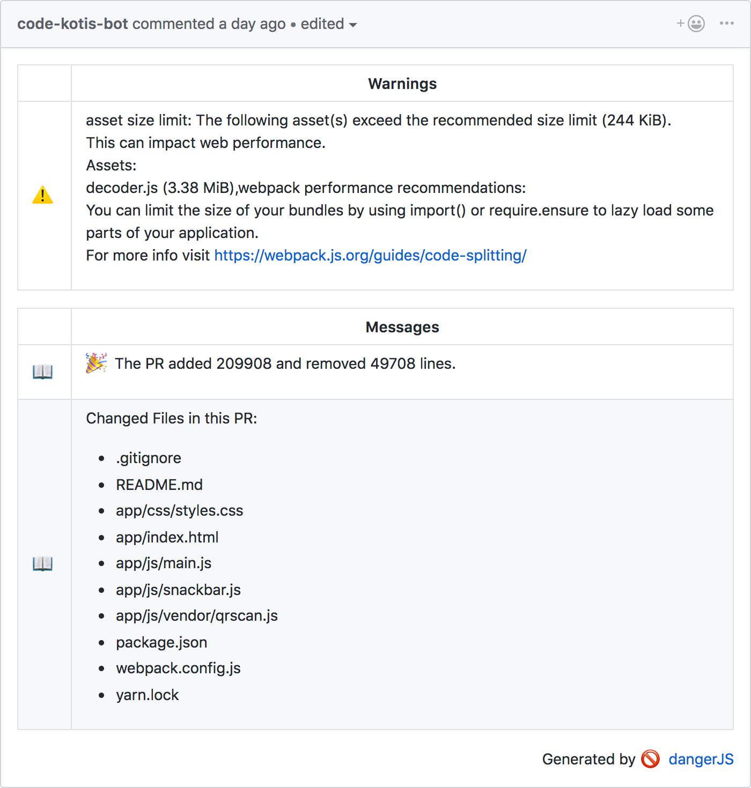

## What is danger.js anyway?

[DangerJS](https://danger.systems/js/) runs during your CI process, and helps your team to automate certain manual code review tasks like:

- Is there a `new library` or `module installed`?
- Does this `PR changes` are added to `changelog file`?
- Is `.lockfile` kept up to date?
- Will this change `increase my bundle size`?
- So on and on.

<b class="m-left-20">Example:</b>

<center>
  
  <i class="m-top-15">React using danger.js</i>
</center>

#### Integrating Danger.js in Github & Travis

<b class="m-left-10 m-top-10">Step 1:</b> Add `dangerjs` to `your devDependencies` in package.json file.

```shell
yarn add danger -D
```

<b class="m-left-10 m-top-10">Step 2:</b> Create `dangerfile.js` file in your project.

<b class="m-left-20">Example:</b>

```js
// Import the feedback functions
import { message, warn, fail, markdown } from "danger"

// Add a message to the table
message("You have added 2 more modules to the app")

//  Adds a warning to the table
warn("You have not included a CHANGELOG entry.")

// Declares a blocking
fail(`ESLint has failed with ${fails} fails.`)

// Show markdown under the table:
markdown("## New module Danger" + dangerYarnInfo)
```

<b class="m-left-10 m-top-10">Step 3 (Optional):</b> Create an `github account` for `your bot`.

<b class="m-left-10 m-top-10">Step 4:</b> Create a [New personal access token](https://github.com/settings/tokens/new) in `github` for `read & write` access for your bot.

<b class="m-left-20">Example:</b>

<center>
  
  <i class="m-top-15">Github Settings Page</i>
</center>

<b class="m-left-10 m-top-10">Step 5 (Final Step):</b> `Hooking danger.js` in [Travis CI](https://travis-ci.org/)

<ul class="m-left-10">
  <li>Copy the <b>generated personal token</b> from your github or your bot account you created.</li>
  <li>Go to your <b>project settings</b> in <b>Travis CI</b>.</li>
  <li>Create a <b>new environment variable</b> called <b>DANGER_GITHUB_API_TOKEN</b> and the value is <b>your personal token</b>.</li>
</ul>

<b class="m-left-20">Example:</b>

<center>
  
  <i class="m-top-15">Travis Settings Page</i>
</center>

After this step, you should be seeing `bot` account adding `comments` to your every PR as per your `dangerfile.js` config.

<b class="m-left-20">Example:</b> <a href="https://github.com/code-kotis/barcode-scanner/pull/57" target="_blank">QR Code Scanner</a>

<center>
  
  <i class="m-top-15"><a href="qrcodescan.in" target="_blank">QR Code Scanner</a></i>
</center>

##### Hot Tips:

You can test your changes locally using following terminal command.

```shell
yarn danger pr <your-pr-link>
```

##### References:

1. [ReactJS](https://github.com/facebook/react/pull/11865/files) dangerfile.
2. [Tutorials](https://danger.systems/js/tutorials.html) for other app such as node app, node libraries etc.
3. [More tutorials](https://danger.systems/js/guides/getting_started.html#setting-up-danger-to-run-on-your-ci) on adding danger.js to other CI's

Thank you for reading my post till the end. If you like my post `share it` 😇.
