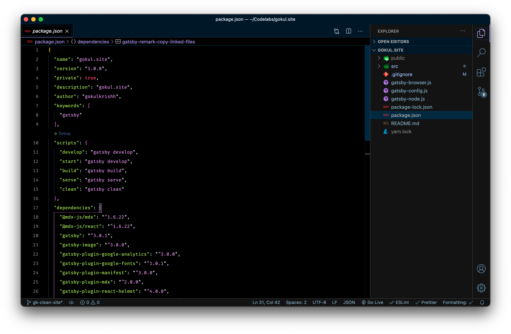

## Computer

I'm using macOS for close to 7 years now. An Intel version for work and an [M1 chip version](https://www.apple.com/in/shop/buy-mac/macbook-pro/13-inch) for personal use. The M1 MacBook pro is absolutely a beast. Battery life is great, performance is top-notch. 4k 10mins video export takes only 5 mins in iMovie, where it took 30m in intel MacBook pro.

## Coding

#### Terminal

- [Iterm 2](https://iterm2.com/) as default terminal app.
- [Iterm 2 Profile](https://github.com/gokulkrishh/dotfiles/blob/master/Default.iterm2.json) file, just import and start using this.
- [Oh My Zsh](https://github.com/ohmyzsh/ohmyzsh) for default shell.
- [Customized verion](https://github.com/gokulkrishh/dotfiles/blob/master/Dracula.terminal) of [dracula theme](https://draculatheme.com/) for the iterm app.

#### Code Editor



- [Visual Studio Code](https://code.visualstudio.com/Download) from Microsoft, is an open source software.
- [Extensions](https://gist.github.com/gokulkrishh/6a8b841f594ff451d66bbcc77307a779) I use in visual studio code.
- [FiraCode](https://github.com/tonsky/FiraCode) as my programming font in both code editor and terminal.
- [Settings](https://github.com/gokulkrishh/dotfiles/blob/master/vscode/settings.json) for vscode editor.

Run the below command in your terminal app to get all the list of extensions in your visual studio code editor.

```bash
npx https://gist.github.com/gokulkrishh/9dd54a34ed93701a37811f0eb2e37822
```

## Mac Applications

- [Itsycal](https://www.mowglii.com/itsycal/) a minimalist calendar app.
- [Sketch](https://www.sketch.com) for designing logos, wireframes, and visual designing.
- I am a [Spotify](https://www.spotify.com/us/download/other/) user.
- [Notion](https://www.notion.so/) for note taking and more.
- [Krisp AI](https://krisp.ai/) to cancel background noise while recording or when doing a video call.

> Check out my [dribbble account](https://dribbble.com/gokulkrishh) for dribbble shots.

## Dotfiles

If you want the same setup as mine in your MacBook, go ahead and install [my dotfiles](https://github.com/gokulkrishh/dotfiles).

### 💅 Comes with

- [Oh My Zsh](https://github.com/robbyrussell/oh-my-zsh) as default terminal shell.
- [Shortcuts & Aliases](./docs/Aliases.md)
- [Homebrew](http://brew.sh/) for installing mac apps and others via command line.
- [NVM](https://github.com/lukechilds/zsh-nvm) for managing node versions.
- [Yarn](https://yarnpkg.com/) for doing fast node modules install, as npm sucks.
- [Z - Jump Around](https://github.com/robbyrussell/oh-my-zsh/tree/master/plugins/z) to jump to the frequent folders without a full path.

## Writing

For writing, I use [Grammarly](https://app.grammarly.com/) to catch common and grammatical errors.

## Youtube

- [iMovie](https://www.apple.com/in/imovie/) for editing videos.
- [Canva](https://canva.com) for creating and editing thumbnail.
- [Maono AU-A04](https://amzn.to/2YIB0lM) condenser microphone kit.
- [Logitech c922 WebCam](https://amzn.to/3atGuGm) for recording live coding.
- [Osaka Tripod Stand](https://amzn.to/2NOwK1J) when I want to use my smartphone as camera.
- [Green Screen](https://amzn.to/3aqGQ0n) for custom background.

Thanks for reading my post. If you have any suggestions or a question comment below.
