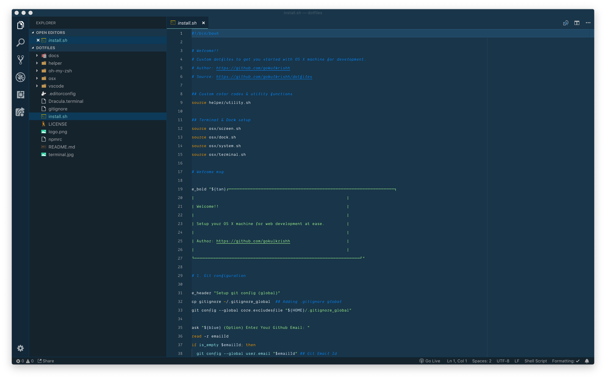
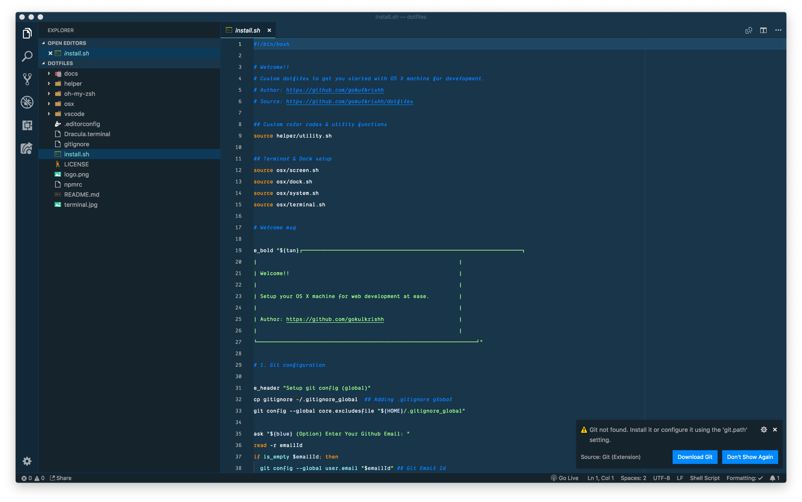

  
  <i><a href="https://carbon.now.sh">https://carbon.now.sh</a></i>

Today after updating macOS from `High Sierra` to `Mojave` in my MacBook Pro, I found out that Mojave has some render issue. Here is how to fix the issue.

### Steps to fix

- Copy this code `defaults write -g CGFontRenderingFontSmoothingDisabled -bool FALSE`.

- Open your terminal application.

- Paste the copied code.

- Logout or Restart your system.

Open the before/after screenshot below in two tabs to see the difference.

### Before

  
  <i>VS Code Editor</i>

  
  <i>Github</i>

### After fix

  
  <i>VS Code Editor</i>

  
  <i>Github</i>

#### Other issues I faced

- Git was not working due to [invalid active developer path](https://apple.stackexchange.com/questions/254380/macos-mojave-invalid-active-developer-path).

Thanks for reading!!

