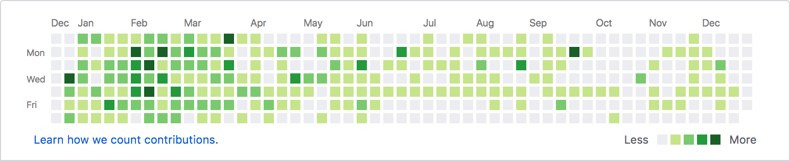

Last year I wrote a list of things I wanted to achieve in 2019. So I thought why not I write a blog post every year-end about what I did throughout the year.

This post will be really helpful when I look back and think about what I did and how much I learned every year etc.

## Summary of the year:

- Read 5 books (Reading my last book **Atomic Habits**).
- I started running 🏃🏻‍♂️ regularly. So far I have run around 150km.
- Started playing football and badminton.
- Delivered 5 talks.
- Started Waking up early on weekdays (6 AM) (This is my keystone habit).
- I wrote only 1 post 🤪 this year (lazy me).
- Took 3 long breaks (This post is written on the 4th break).
- Contributed to 2 Open Source Projects.
- Created a couple of Open Source Projects.
- Curated & Maintained a newsletter.

### My blog posts

I wrote only 1 article in 2019 😆. In 2020, I am planning to write at least 1 article per month 😬.

### Few blogs I frequent visit:

<ol class="disc">
<li> <a href="http://dev.to">http://dev.to</a></li>
<li> <a href="https://web.dev">https://web.dev</a></li>
<li> <a href="https://v8.dev">https://v8.dev</a></li>
<li> <a href="http://kentcdodds.com">http://kentcdodds.com</a></li>
<li> <a href="http://overreacted.io">http://overreacted.io</a></li>
<li> <a href="https://css-tricks.com">https://css-tricks.com</a></li>
</ol>

I also maintain a git repo called [Today I Liked](https://github.com/gokulkrishh/today-i-liked) which has all the articles I read throughout this year.

### Open Source Projects

- [Habits Tracker](https://github.com/gokulkrishh/habits-tracker) - Habits tracker app, I got this idea from [siddharth kp](https://twitter.com/siddharthkp) and took the design from [Aleksey Tsvetkov](https://dribbble.com/tsvetkov).

- [Teardown](https://github.com/gokulkrishh/teardown) - 💣 Teardown the published project in surge.sh via command line.
- [React Hooks Accordion](https://github.com/gokulkrishh/react-hooks-accordion) - A simple accordion using react hooks 🤪.
- [Awesome Web Newsletters](https://github.com/gokulkrishh/awesome-web-newsletters) - 🔥 List of awesome web-related newsletter to subscribe.
- [Tic Tac Toe](https://github.com/gokulkrishh/tic-tac-toe) - Dumbest tic tac toe game ever built using react hooks :P.
- [Generate Newsletter](https://github.com/code-kotis/this-week-in-web/tree/master/packages/generate-newsletter) - Newsletter template generator for [This Week In Web](https://www.this-week-in-web.com/) newsletter. Co-creator is my friend [shidhin](https://twitter.com/shidhincr).
- [Useful npx Commands](https://git.io/useful-npx-commands) - List of useful npx commands I use regularly but not ready to install globally 🤨.

I have more OSS projects in my GitHub, in which some are `half baked/just ideas` and some are completed fully but in private repo.

More open-source projects can be found [here](https://github.com/gokulkrishh?tab=repositories).

### Git streaks

Once my wise friend [Hemanth](https://twitter.com/gnumanth) told me that git streaks are just gimmicky and all it does is put stress on you and that he stopped doing it. I wanted to stop as well and take breaks whenever I can and I need to.

Hence my streaks look like this.

But now looking back I took a lot of breaks 🙄😆 and feel great about it.

### Newsletter

Along with my friends [Shidhin](https://twitter.com/shidhincr) and [Hemanth](https://twitter.com/gnumanth), we **redesigned** & **rebranded** our newsletter (previously known as [pwa.tips](pwa.tips)) as [this week in web](this-week-in-web.com).

Name is heavily inspired from [this week in react](https://this-week-in-react.org/) newsletter from [Philipp Spiess](https://twitter.com/PhilippSpiess) do check out his newsletter.

As of today, our newsletter has **570+ subscribers**. We have subscribers all around the world (**USA, Germany, India, Turkey, Japan**, etc).

And our top readers are from **USA**.

##### Things we use for our newsletter

- [Gatsby](https://www.gatsbyjs.org/) - Gatsby is a free and open-source framework based on React.
- [Generate Newletter](https://github.com/code-kotis/this-week-in-web/tree/master/packages/generate-newsletter) and along with google sheet to generate newsletter template which hardly takes 2 mins.
- [Mailchimp](https://mailchimp.com/) - Mailchimp is free up to 2k subscribers.

### Talks

| Date    | Title                                                                                                                                                  | Location                 | Event        |
| ------- | ------------------------------------------------------------------------------------------------------------------------------------------------------ | ------------------------ | ------------ |
| Aug 14  | [Technical Committee 39 (TC39)](https://docs.google.com/presentation/d/1g7YZibJF0LMpWAyEl6AONC3WPHJSwxOiy0Dq9taQKK4/edit?usp=sharing)                  | Bangalore, Thoughworks   | UI Catchup   |
| July 29 | [Intro to ReactJS in 2019](https://docs.google.com/presentation/d/1iCtNr8xlH6uufLQ01OFvBqce19CzCOoyqGvqAVCGbSw/edit#slide=id.g5e4b92bcb9_0_0)          | Bangalore, Thoughworks   | Office Level |
| July 11 | [Serverless for Frontend Developers](https://docs.google.com/presentation/d/1LmWcHfBRdEOksGdatROygwdcWk8MMF6Hy4kK40Qy2h8/edit#slide=id.gc6f73a04f_0_0) | Bangalore, Thoughworks   | UI Catchup   |
| May 11  | [Performance Budgeting](https://docs.google.com/presentation/d/1ne7SqVT1CzrVuHIFfSdUuWYkgEYfhnnbOxYgJgcy3bs/edit#slide=id.p)                           | Bangalore, Paypal Office | PaypalJs     |
| Apr 07  | [Let's Talk Web Performance](https://docs.google.com/presentation/d/1If2_RCcxu9ICHsAQ06t1zUP8bE1wunBWb2Bm9qNimGg/edit#slide=id.p1)                     | Bangalore, Thoughworks   | UnFold UI    |

### Books I read

- [Power Of Habits](https://www.goodreads.com/book/show/12609433-the-power-of-habit) - Why We Do What We Do in Life and Business
- [Only Time Will Tell](https://www.goodreads.com/book/show/10872085-only-time-will-tell) - The epic tale of Harry Clifton’s life begins in 1920.
- [Sapiens](https://www.goodreads.com/book/show/23198201-sapiens) - A Brief History of Humankind
- [Kathaikal Sollum Pathai](https://www.goodreads.com/book/show/48390649?ac=1&from_search=true&qid=uX3f0O6hDt&rank=1) - A total of 23 short stories in Tamil 😍.
- [Atomic Habits](https://www.goodreads.com/book/show/40121378-atomic-habits?ac=1&from_search=true&qid=rHk8AhEc0Y&rank=1) - An Easy & Proven Way to Build Good Habits & Break Bad Ones (In Tamil Publication) (Currently Reading 📖)

### List of things (Professional) I learned

- Docker
- Node, Express
- GraphQL
- What is Technical Committee 39 (TC39).
- Serverless
- Data Structures & Algorithms

### Conclusion

All in all, I feel great this year than the previous year. I have accomplished a lot of things and I learned a lot too both professionally & personally. In 2020 I again have a huge list of things I want to accomplish and things I want to continually do every year.

So, thanks for reading, see you next year for the same.
