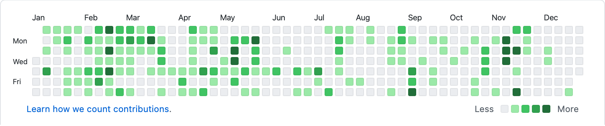

This is my second year in review post, so many things happened in the year 2020 and I want to retrospect to understand what I did better and what I could do better in 2021 and my area of improvements.

At the beginning of the year 2020, I thought I will write reviews monthly which will help me improve things on monthly basis rather than year by year. It went well for a few months but then the COVID pandemic hit the world and you know the rest of the story.

P.S: You might hear me ranting about this COVID pandemic throughout this post and how it affected my progress. So don’t mind me 😅

### Goals I had for 2020

- Reading
- Coding (pet projects)
- Blogs & Newsletters
- Writing a book
- Physical activities
- Speaking
- Learn a new language
- Breaks

#### 1. Reading

I have to say, I have outdone myself in this category by overachieving it. For this year, my goal was to read 8 books and I am currently reading 11th and 12th book which I will be finishing it before year-end. I am so happy I was able to find time to read more books.

Find what I read in [good reads](https://www.goodreads.com/review/list/25595771-gokulakrishnan?date_added=2020&order=a&shelf=2020&visible_control=batchEdit#).

#### 2. Coding

Well, I will let my Github streaks speak for my coding habit. The year 2020, was not easy for many of us and I was struggling to concentrate as this pandemic was wreaking havoc on our planet. And if you read my last year's review, like I said this streak doesn’t matter, and don’t let it stress you by seeing other's streak and for the very reason I have added it here.

  

#### 3. Blogs & Newsletters

**[Personal Blog](https://gokul.site)**

Page Views - 10,958 (total views) and 3,832 (unique views).

And, I can see so many people were interested in knowing me by checking the about me page 🤗.

**[How it works - A javascript series](https://github.com/gokulkrishh/how-it-works)**

Email Sent - 11 (emails)
Email Open - 772 (times)
Post Read - 4,826 (total views) and 3,832 (unique views)

**[This Week In Web](https://github.com/code-kotis/this-week-in-web)**

This week in web newsletter was done with the collaboration of my friend [Shidhin](https://twitter.com/shidhincr).

- **Email Sent**: 28 (emails)
- **Email Open**: 4732 (times)
- **Post Read**: 3,484 (total views) and 2,267 (unique views)

#### 4. Writing a book - Beginner’s Guide To Web Security

I never thought I will write a book in my lifetime, the main reason is I am lazy. But during the pandemic, I got inspired by so many people who were using their time during the lockdown by writing books, blogs, etc. So I thought why not? So I took a topic which I was least interested in and less known to me. I am glad I was able to finish it within a month.

To celebrate my achievement in writing a book, I am giving away 5 free book copies. Use this coupon **yeahiwroteabook**. And if you were not able to grab a free copy, don’t worry my book will be sold for a 50% offer for a week. Click the above book link on top to purchase it now.

And I want to thank the people who bought my book.

**Stats:**

So far I have made around ~200$ and it's not just about the money but it is an incentive for me to keep going.

#### 5. Physical activities

I am a football player or used to be and it is my fav sport (⚽️ Barcelona) somehow I was able to play around 10+ games this year before the pandemic. My most enjoyable physical activity was running. And for me running was sort of an acquired habit.

##### Some stats on my activities:

- **Total Runs:** 60
- **Total Kilometer:** 159.9
- **Running Workouts:** 92
- **Badminton:** 7+ games (Thanks to my friends)

#### 6. Speaking:

I couldn't speak this year at all, last year I spoke 5+ times and this year it is just 1 talk. That's it.

#### 7. Learn a new language:

I am a big anime fan, I tried learning Japanese just so I can watch the anime without English subtitles but I couldn’t progress much but on the brighter side, I can understand 25% of Japanese now, and before it was 0%.

#### 8. Breaks

I took 4 long breaks and I am exhausted from my leaves for this year as well. It’s 0 now yaas it is zero.

### Goals for 2021

- Reading (12 books & many more blog posts)
- More Coding & Pet Projects (I have so many ideas for a pet project, ping me if you want to collaborate with me)
- Writing Blogs & Newsletters (I will continue how it works series and will add more posts to my blog)
- Books (Yas I am planning to write one more book, subscribe to my newsletter to know more)
- Physical activities (more running at least 200 KM’s)
- Speaking (at-least 5)

Thanks for reading this post and subscribe to my newsletter for more updates about my upcoming new book and pet projects. If you have any suggestions or a question comment below.